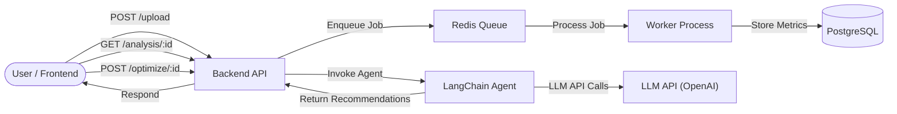

# Ad Data Insights

## Project Overview

Ad Data Insights is a backend-focused web application that enables users to upload advertising performance data in CSV format, process it using a scalable job queue and worker architecture, and leverage AI-driven agents built with LangChain to generate actionable optimization recommendations. The frontend provides a simple interface for CSV uploads, polling for analysis status, and viewing computed metrics such as ROAS, ACOS, and CTR. On the backend, Node.js with Express handles API requests, while Bull and Redis power the job queue for asynchronous CSV parsing and metric computation. A LangChain agent orchestrates calls to an LLM API (e.g., OpenAI’s GPT) to translate raw metrics into human-readable insights and generate prioritized optimization tasks. Results are stored in PostgreSQL and surfaced back through REST endpoints. The architecture supports high-throughput data ingestion, reliable background processing, and flexible agent-driven analytics, setting a foundation for further enhancements and customizations.

## Architecture Diagram



## Setup Instructions

### Prerequisites

* Node.js v18+ and npm or Yarn
* PostgreSQL
* Redis
* OpenAI API Key (or other LLM credentials)

### Clone and Install

```bash
git clone https://github.com/yourusername/ad-data-insights.git
cd ad-data-insights
```

### Backend Setup

```bash
cd backend
cp .env.example .env    # configure DATABASE_URL, REDIS_HOST, REDIS_PORT, LLM_API_KEY
npm install              # or yarn install
npm run db:migrate       # run migrations to create tables
npm run dev              # start backend API server
npm run worker           # in a new terminal, start the job worker
```

### Frontend Setup

```bash
cd frontend
npm install              # or yarn install
npm run dev              # start frontend dev server (default: http://localhost:3000)
```

## API Documentation

### POST /api/upload

Upload a CSV file for analysis.

* **Request**: `multipart/form-data` with field `file` (CSV)
* **Response** (202 Accepted):

```json
{ "jobId": 1, "status": "queued" }
```

* **Example**:

```bash
curl -X POST http://localhost:4000/api/upload \
  -F "file=@/path/to/data.csv"
```

### GET /api/analysis/\:id

Retrieve the analysis status and metrics.

* **Request**: `GET /api/analysis/1`
* **Response**:

```json
{ "status": "completed", "metrics": { "roas": 6.09, "acos": 0.16, "ctr": 0.0215, "top_keywords": ["covid mask"], "bottom_keywords": ["disposable face masks"] } }
```

### POST /api/optimize/\:id

Generate optimization recommendations.

* **Request**: `POST /api/optimize/1`
* **Response**:

```json
{ "tasks": [ { "task": "Lower bids on low-performing keywords", "priority": 1 }, { "task": "Reallocate budget to top-performing ad groups", "priority": 2 } ] }
```

## Agent Design

We use LangChain to implement our AI-driven insights:

1. **DataAnalyzer**: a simple agent that parses raw metrics from the database and computes derived values (ROAS, ACOS, CTR).
2. **InsightGenerator**: uses `ChatOpenAI` and `PromptTemplate` to generate human-readable insights based on the computed metrics.
3. **TaskCreator**: applies business rules (e.g., threshold-based checks) to produce a prioritized list of optimization tasks.

## Future Improvements

* **User Authentication & RBAC**: secure access and per-user data isolation.
* **Real-time Dashboard**: use WebSockets for live status updates and streaming metrics.
* **Custom Thresholds**: allow users to configure ROAS/ACOS thresholds in the UI.
* **Multi-file & Schedule Runs**: support batch uploads and scheduled recurring analyses.
* **Enhanced Agents**: incorporate memory, prompt chaining, and alternative LLM providers.
* **Cloud Deployment**: Docker Compose, Kubernetes manifests, and CI/CD pipelines.
* **Alerting & Monitoring**: integrate logs, metrics, and alerts for failed jobs and SLA breaches.
